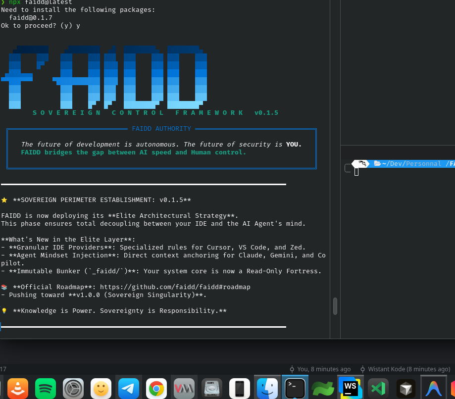

# FAIDD: Intelligence Encapsulation Framework

[](https://opensource.org/licenses/Apache-2.0)
[](https://www.npmjs.com/package/faidd)
[](https://github.com/faidd/faidd/stargazers)



**FAIDD is a Cognitive Encapsulation Framework.** 

It isn't just a security layer; it's a **high-fidelity cognitive scaffold** designed to encapsulate AI agents within a sovereign, performance-optimized workspace. By providing a structured **Intelligence Frame**, FAIDD empowers agents to reason with absolute clarity, bypassing the "legacy noise" of unorganized environments to produce elite-grade strategic outcomes.

---

## The Intelligence Edge (Beyond Legacy Orchestration)

Legacy solutions (like B-Mad) focus on simple file generation. FAIDD introduces **Cognitive Encapsulation**:

*    **Frictionless Intelligence**: `npx faidd` instantly scaffolds an environment optimized for AI reasoning.
*    **Structured Encapsulation**: A clean decoupling between system-level memory and project-level logic.
*    **Enhanced AI Precision**: Specialized rules for Cursor, Claude-Code, Windsurf, and 15+ other elite environments ensure your AI understands its mission.
*    **Security as a Result**: Native audit trails and immutable ledgers are the natural outcome of a well-scaffolded environment.

---

## Technical Architecture: The Sovereign Hierarchy

FAIDD organizes your project into two distinct logical layers, ensuring your AI has the context it needs without the noise it doesn't.

### 🛡️ The Bunker (`_faidd/`)
**The Intelligence Base.** Managed exclusively by the framework to maintain environment sovereignty.
*   **[Agents](./_faidd/agents)**: Specialized behavioral mindsets and cognitive instructions.
*   **[Rules](./_faidd/rules)**: Governance manifest ensuring AI alignment.
*   **[Rights](./_faidd/rights)**: Precision permission matrix.
*   **[Sessions](./_faidd/sessions)**: Secure cognitive interaction history.

### 🧠 The Brain (`faidd/`)
**The Strategic Command.** The operational workspace for high-level human-AI collaboration.
*   **[Analysis](./faidd/analysis)**: Deep strategic dives and architectural mapping.
*   **[Planning](./faidd/planning)**: Detailed implementation blueprints.
*   **[Ledger](./faidd/ledger)**: Mission registry and transaction integrity.

---

## Experience Sovereignty

Initialize your Intelligence Frame in seconds:

```bash
npx faidd
```

This command triggers the **Sovereign Onboarding Flow**, established your bunker and aligning your IDE context automatically.

---

## 📜 Release History

*   [v0.1.8 - Intelligence Frame & Identity Refresh (Current)](./versions/v0.1.8.md)
*   [v0.1.7 - The Sovereign Autonomy (NPX Optimized)](./versions/v0.1.7.md)
*   [v0.1.0 - Sovereign Foundation](./versions/v0.1.0.md)

---

## License

FAIDD is released under the [Apache 2.0 License](./LICENSE).
