<p align="center">
  
</p>

<p align="center">
  <a href="https://opensource.org/licenses/Apache-2.0"></a>
  <a href="https://www.npmjs.com/package/faidd"></a>
  <a href="https://www.npmjs.com/package/faidd"></a>
  <a href="https://github.com/faidd/faidd/stargazers"></a>
</p>

---

**FAIDD is a Cognitive Encapsulation Framework.**

Most AI orchestration tools (like B-Mad) focus on simple file generation. FAIDD is different. It provides a **high-fidelity cognitive scaffold**—a structured environment where AI agents reason with absolute clarity, bypassing unorganized "legacy noise" to produce elite strategic outcomes.

## 🚀 Why "Intelligence Encapsulation"?

Standard AI coding environments suffer from **Context Drift** and **Cognitive Fragmentation**. FAIDD solves this by creating a **Sovereign Perimeter** around your project:

*   **Intelligence Scaffolding**: `npx faidd` instantly establishes a performance-optimized frame.
*   **Decoupled Memory**: A strict physical split between system rules (Bunker) and project logic (Brain).
*   **Multi-Agent Alignment**: Pre-built rules for **Cursor, Claude-Code, Windsurf**, and 15+ other elite environments.
*   **Security by Design**: Audit trails and immutable ledgers are the natural outcome of a structured environment.

---

## 🏗️ The Sovereign Hierarchy

FAIDD organizes your space into two distinct logical layers:

```mermaid
graph TD
    User((Architect)) --> CLI[FAIDD CLI]
    CLI --> Bunker["🛡️ The Bunker (_faidd/)"]
    CLI --> Brain["🧠 The Brain (faidd/)"]
    
    subgraph "System Perimeter (Read-Only)"
    Bunker --> Agents[AI Mindsets]
    Bunker --> Rules[Governance]
    Bunker --> Rights[ACL Matrix]
    end
    
    subgraph "Operational Workspace"
    Brain --> Analysis[Deep Dives]
    Brain --> Planning[Blueprints]
    Brain --> Ledger[Audit Trail]
    end
```



---

## ⚡ Quick Start: Experience Sovereignty

Initialize your Intelligence Frame in seconds:


```bash
npx faidd
```

---

## 📈 Community Growth (Dynamic)

[](https://star-history.com/#faidd/faidd&Date)

---

## 📜 Release History

*   **[v0.1.8 - The Intelligence Singularity](./versions/v0.1.8.md)** : Identity Refresh & Clean Architecture.
*   **[v0.1.7 - Sovereign Autonomy](./versions/v0.1.7.md)** : NPX Optimization & Portable Registry.
*   **[v0.1.0 - The Foundation](./versions/v0.1.0.md)** : Initial Sovereign Scaffolding.

---

## ⚖️ License

FAIDD is released under the [Apache 2.0 License](./LICENSE). Built by Architects, for Architects.
