<p align="center">
  
</p>

<p align="center">
  <a href="https://opensource.org/licenses/Apache-2.0"></a>
  <a href="https://www.npmjs.com/package/faidd"></a>
  <a href="https://www.npmjs.com/package/faidd"></a>
  <a href="https://github.com/faidd/faidd/stargazers"></a>
</p>

---

# 🛡️ FAIDD: The Intelligence Encapsulation Framework

**FAIDD is not a code generator. It is the Sovereign Perimeter where code is born.**

Most AI orchestration tools (like legacy B-Mad) focus on the output—generating files, pushing commits, writing boilerplates. They treat the AI as a simple worker. **FAIDD treats the AI as a strategic entity** that requires a high-fidelity environment to function at peak performance.

## 🧠 The Mission: Cognitive Scaffolding

In unorganized environments, AI agents suffer from **Cognitive Fragmentation**. They get lost in the noise of your root directory, misinterpret your project rules, and eventually "drift" away from the mission. 

FAIDD establishes an **Intelligence Frame**—a physical and logical scaffold that encapsulates the agent's reasoning. By enforcing a strict hierarchy between system-level memory and project-level execution, FAIDD ensures that every token generated by the AI is aligned with your absolute strategic intent.

---

## 🚀 The Three Pillars of Sovereignty

### 1. High-Fidelity Encapsulation

FAIDD wraps your development session in a **Sovereign Perimeter**. It's the difference between coding in a crowded street and coding in a high-tech command center. Your AI is "shielded" from project noise, allowing it to focus 100% of its attention on the task at hand.

### 2. Tactical Alignment (Bunker vs. Brain)

We enforce a strict **Physical Decoupling** of project consciousness:

* **The Bunker (`_faidd/`)**: The immutable core. It holds the "Soul" of your project—your agents, your governance rules, and your session history. It is the system of record.
* **The Brain (`faidd/`)**: The operational command. It's where the deep analysis and architectural planning happen. It is the tactical layer of the project.

### 3. Multi-Agent Mastery

FAIDD isn't built for one tool. It is the **Cognitive Layer** for the world's most powerful AI IDEs. Whether you use **Cursor, Claude-Code, Windsurf**, or local LLMs, FAIDD provides the uniform structure they need to understand their mission with zero friction.

---

## 🏗️ Technical Architecture

```mermaid
graph TD
    User((Architect)) --> CLI[FAIDD CLI]
    CLI --> Bunker["🛡️ The Bunker (_faidd/)"]
    CLI --> Brain["🧠 The Brain (faidd/)"]
    
    subgraph "Sovereign Layer (Immutable Context)"
    Bunker --> Agents["Agents: Cognitive Mindsets"]
    Bunker --> Rules["Rules: Alignment Manifests"]
    Bunker --> Rights["Rights: ACL Matrix"]
    end
    
    subgraph "Operational Layer (Strategic Context)"
    Brain --> Analysis["Deep Strategic Dives"]
    Brain --> Planning["Feature Blueprints"]
    Brain --> Ledger["Mission Audit Trail"]
    end
```



---

## ⚡ Quick Start: Deploy the Frame

Experience the power of structured intelligence in under 10 seconds.


```bash
npx faidd
```

This command triggers the **Sovereign Onboarding Flow**, established your workspace identity and aligning your AI environment automatically.

---

## 📊 Star History & Growth

*The community of Architects is growing. Join the evolution.*

[](https://star-history.com/#faidd/faidd&Date)

---

## 📜 Release History

| Version | Milestone | Narrative | Status |
| :--- | :--- | :--- | :--- |
| **v0.1.8** | [The Intelligence Singularity](./versions/v0.1.8.md) | Identity Refresh & Clean Architecture | **Current** |
| **v0.1.7** | [Sovereign Autonomy](./versions/v0.1.7.md) | NPX Optimization & Portable Registry | Stabilized |
| **v0.1.0** | [The Foundation](./versions/v0.1.0.md) | Initial Sovereign Scaffolding | Legacy |

---

## ⚖️ License

FAIDD is released under the **Apache 2.0 License**. Distributed for the elite, built for the autonomous age.
